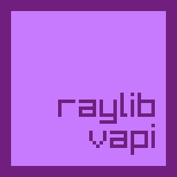

<div align="center"></div>

# Raylib VAPI

Bindings for for [Vala](https://vala.dev/) to use the simple and easy to use graphics library [Raylib](https://github.com/raysan5/raylib).

## Description
Ralib VAPI currently supports the core module of Raylib using a C style API for ease of code porting.

Some VAPI's will be released to follow a more [OOP design](https://en.wikipedia.org/wiki/Object-oriented_programming) as well if you wish to use them in a more traditional Vala style;

## Supported Modules

| Module  | Supported          | OOP Available      | VAPI Name   | Version |
|:-------:|:------------------:|:------------------:|:-----------:|:-------:|
| core    | :heavy_check_mark: | :x:                | raylib.vapi | 4.2     |
| rlgl    | :x:                | :x:                |             |         |
| raymath | :x:                | :x:                |             |         |
| raudio  | :x:                | :x:                |             |         |
| raygui  | :x:                | :x:                |             |         |
| rpng    | :x:                | :x:                |             |         |
| res     | :x:                | :x:                |             |         |

## Example
```vala
using Raylib;

public const int WINDOW_WIDTH = 800;
public const int WINDOW_HEIGHT = 450;

public static int main (string[] args) {
    init_window (WINDOW_WIDTH, WINDOW_HEIGHT, "raylib [core] example - basic window");

    set_target_fps (60);

    while (!window_should_close ()) {
        begin_drawing ();
            clear_background (RAYWHITE);

            draw_text ("Congrats! You created your first window!", 190, 200, 20, LIGHTGRAY);
        end_drawing ();
    }

    close_window ();
}
```

## Compiling Included Examples
```bash
meson build -C build

cd build/examples/

Camera3D/application        # To run the 3D camera example
                            # or
SmoothPixel/application     # To run the smooth pixel perfect example
```
