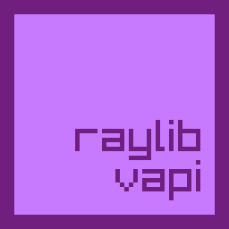

<div align="center"></div>

# Raylib VAPI

Bindings for [Vala](https://vala.dev/) to use the simple and easy to use graphics library [Raylib](https://github.com/raysan5/raylib).

## Description
Raylib VAPI currently supports the core module of Raylib using a C style API for ease of code porting.

Some VAPI's will be released to follow a more [OOP design](https://en.wikipedia.org/wiki/Object-oriented_programming) as well if you wish to use them in a more traditional Vala style.

## Supported Modules

| Module  |      Supported      | OOP Available |  VAPI Name   | Version |                                         Notes                                         |
|:-------:|:-------------------:|:-------------:|:------------:|:-------:|:-------------------------------------------------------------------------------------:|
| raylib  | :heavy_check_mark:  |      :x:      | raylib.vapi  |   6.0   |                                                                                       |
|  rlgl   | :heavy_check_mark:  |      :x:      |  rlgl.vapi   |   6.0   |                                                                                       |
| raymath | :heavy_check_mark:  |      :x:      | raymath.vapi |   6.0   |                                                                                       |
| raudio  | :heavy_check_mark:  |      :x:      | raudio.vapi  |         | Implicit in raylib.vapi. Only use raudio.vapi if you only need audio and nothing else |
| raygui  |         :x:         |      :x:      |              |         |                                                                                       |
|  rpng   |         :x:         |      :x:      |              |         |                                                                                       |
|  rini   | :heavy_check_mark:  |      :x:      |  rini.vapi   |   3.0   |                                                                                       |
| physac  | :heavy_check_mark:  |      :x:      | physac.vapi  |   1.1   |                                                                                       |
|  rres   |         :x:         |      :x:      |              |         |                                                                                       |

## Example
```vala
using Raylib;

public const int WINDOW_WIDTH = 800;
public const int WINDOW_HEIGHT = 450;

public static int main (string[] args) {
    init_window (WINDOW_WIDTH, WINDOW_HEIGHT, "raylib [core] example - basic window");

    set_target_fps (60);

    while (!window_should_close ()) {
        begin_drawing ();
            clear_background (RAYWHITE);

            draw_text ("Congrats! You created your first window!", 190, 200, 20, LIGHTGRAY);
        end_drawing ();
    }

    close_window ();

    return 0;
}
```
